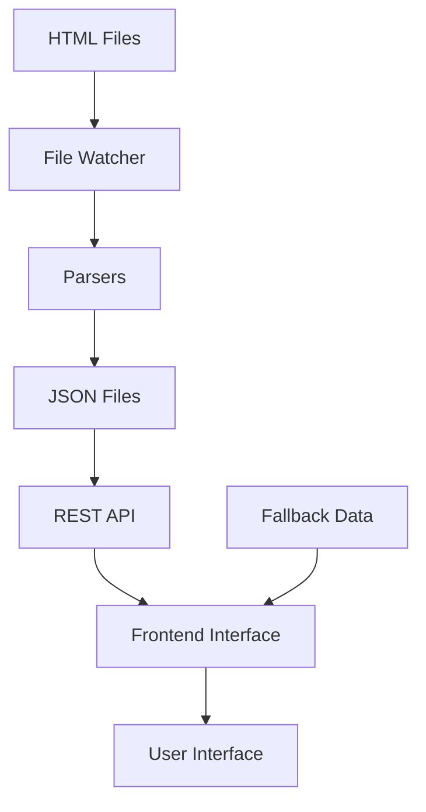

# Medical Records Integration Guide

This document explains how to set up and use both the backend **Record Transformer** service and the frontend **API Medical Interface**.

## 📋 Overview

The system consists of:

1. **Backend Service** (`record-transformer/`) - Transforms HTML medical records to JSON API
2. **Frontend Interface** (`api-medical-interface.html`) - Modern UI that consumes the API
3. **Offline Fallback** - Works without backend using sample data

---

## 🚀 Quick Start

### 1. Backend Setup

```bash
cd record-transformer
npm install
npm run setup
npm start
```

The backend will:
- Start on port 3001
- Watch for HTML files in `data/raw/FACILITY_NAME/`
- Process and serve data via REST API
- Update every 30 minutes automatically

### 2. Frontend Setup

Simply open `api-medical-interface.html` in a web browser. The interface will:
- Automatically connect to the backend API
- Fall back to sample data if backend is unavailable
- Provide full offline functionality

### 3. Test the Integration

1. **With Backend**: Start backend and open frontend - should show "Connected to API"
2. **Without Backend**: Open frontend only - should show "Offline Mode" with sample data

---

## 🔧 Backend API Service

### Directory Structure
```
record-transformer/
├── data/
│   ├── raw/                    # Input HTML files
│   │   ├── FACILITY_NAME/
│   │   │   ├── Facesheet_data.html
│   │   │   ├── MED_data.html
│   │   │   ├── TRE_data.html
│   │   │   └── Oth_data.html
│   └── parsed/                 # Output JSON files
│       ├── 12345.json          # Individual residents
│       └── index.json          # Residents list
├── src/
│   ├── parsers/               # HTML parsers
│   ├── services/              # Business logic
│   └── server.js              # Express server
└── package.json
```

### API Endpoints

| Endpoint | Method | Description |
|----------|--------|-------------|
| `/health` | GET | Service health check |
| `/residents` | GET | List all residents |
| `/residents/:id` | GET | Get specific resident |
| `/status` | GET | Processing status |

### Sample Response - `/residents`
```json
{
  "lastUpdated": "2024-02-20T10:30:00Z",
  "totalResidents": 4,
  "facilitiesProcessed": 4,
  "residents": [
    {
      "ResidentID": "12345",
      "Name": "John Doe",
      "facility": "RUSSLL_DAY",
      "hasData": {
        "facesheet": true,
        "medications": true,
        "treatments": true,
        "orders": true
      }
    }
  ]
}
```

### Sample Response - `/residents/12345`
```json
{
  "ResidentID": "12345",
  "Name": "John Doe",
  "facility": "RUSSLL_DAY",
  "facesheet": {
    "ResidentName": "John Doe",
    "Age": "75",
    "BirthDate": "1949-03-15",
    "Gender": "Male",
    "Allergies": "NKDA"
  },
  "medications": [...],
  "treatments": [...],
  "orders": [...]
}
```

---

## 🖥️ Frontend Interface

### Features

- **Modern Responsive Design** - Works on desktop and mobile
- **Real-time Status** - Shows API connection status
- **Filtering** - By record type and facility
- **Detailed Views** - Expandable sections for each record type
- **Offline Support** - Full functionality without backend

### Components

1. **ResidentProfileCard** - Overview cards with data availability badges
2. **MedicationTable** - Structured medication display
3. **TreatmentTimeline** - Chronological treatment view
4. **OrderList** - Categorized orders (labs, therapies, etc.)

### File Structure
```
├── api-medical-interface.html  # Main interface
├── js/
│   ├── api-client.js          # Backend communication
│   ├── components.js          # UI components
│   ├── app.js                # Main application logic
│   └── fallback-data.js       # Offline sample data
└── styles/
    └── medical-api-interface.css
```

---

## 🔄 Data Flow



1. **Input**: HTML medical records placed in `data/raw/FACILITY_NAME/`
2. **Processing**: Backend watches, parses, and converts to JSON
3. **Storage**: JSON stored in `data/parsed/` directory
4. **API**: Express.js serves data via REST endpoints
5. **Frontend**: Interface fetches and displays data
6. **Fallback**: Sample data used when API unavailable

---

## 📊 Data Mapping

### From HTML/XML to JSON

The parsers extract data from embedded XML in HTML files:

| Source File | Target Data | Description |
|-------------|-------------|-------------|
| `Facesheet_data.html` | `facesheet` | Demographics, allergies, diagnoses |
| `MED_data.html` | `medications[]` | Medication orders and schedules |
| `TRE_data.html` | `treatments[]` | Treatment orders and therapies |
| `Oth_data.html` | `orders[]` | Labs, imaging, consultations |

### Resident Record Structure
```json
{
  "ResidentID": "unique-id",
  "Name": "Patient Name",
  "facility": "FACILITY_CODE",
  "facesheet": { demographics and medical info },
  "medications": [ array of medication objects ],
  "treatments": [ array of treatment objects ],
  "orders": [ array of order objects ]
}
```

---

## 🛠️ Configuration

### Backend Environment (.env)
```bash
PORT=3001
NODE_ENV=development
PROCESSING_INTERVAL=30
ALLOWED_ORIGINS=http://localhost:3000,http://127.0.0.1:3000
LOG_LEVEL=info
```

### Frontend API Client
```javascript
// Default backend URL
const apiClient = new ApiClient('http://localhost:3001');

// Custom configuration
const apiClient = new ApiClient('http://your-backend:3001');
```

---

## 🔧 Troubleshooting

### Backend Issues

**Service won't start:**
```bash
cd record-transformer
npm install
npm run setup
```

**No data being processed:**
- Check that HTML files are in `data/raw/FACILITY_NAME/`
- Verify XML content in HTML files has `<script id="DRXML">` or `<script id="FSXML">`
- Check console logs for parsing errors

**API not accessible:**
- Verify port 3001 is not in use
- Check CORS settings in server configuration
- Ensure firewall allows connections

### Frontend Issues

**"Connection failed" message:**
- Backend may not be running
- Check backend URL in `api-client.js`
- Interface will fall back to sample data automatically

**No residents showing:**
- May be using empty fallback data
- Check browser console for errors
- Verify sample data is loaded from `fallback-data.js`

**Styling issues:**
- Ensure `styles/medical-api-interface.css` is loaded
- Check browser compatibility (modern browsers required)

---

## 🚀 Deployment

### Development
```bash
# Start backend
cd record-transformer && npm start

# Open frontend
open api-medical-interface.html
```

### Production

1. **Backend**: Deploy to server with Node.js
2. **Frontend**: Serve static files via web server
3. **Data**: Mount persistent volume for `/data` directory
4. **Monitoring**: Use `/health` endpoint for health checks

### Docker Deployment
```dockerfile
# Backend Dockerfile
FROM node:18-alpine
WORKDIR /app
COPY package*.json ./
RUN npm install
COPY . .
EXPOSE 3001
CMD ["npm", "start"]
```

---

## 📈 Monitoring

### Health Checks
- `GET /health` - Service availability
- `GET /status` - Processing status and metrics

### Metrics Available
- Total residents processed
- Facilities processed
- Last processing timestamp
- Processing errors
- API response times

### Logging
- File processing activities
- API request/response logs
- Error tracking and debugging
- Performance metrics

---

## 🔮 Future Enhancements

### Planned Features
- [ ] WebSocket real-time updates
- [ ] User authentication and authorization
- [ ] Advanced search and filtering
- [ ] Data export functionality
- [ ] Analytics dashboard
- [ ] Mobile app using same API

### Scalability Considerations
- Database backend for large datasets
- Caching layer (Redis)
- Load balancing for multiple instances
- API rate limiting
- Data archiving strategies

---

## 📞 Support

For technical issues:
1. Check logs in browser console and server output
2. Verify file structure and permissions
3. Test API endpoints directly
4. Review this documentation

The system is designed to be resilient - the frontend works offline, and the backend gracefully handles missing files.
